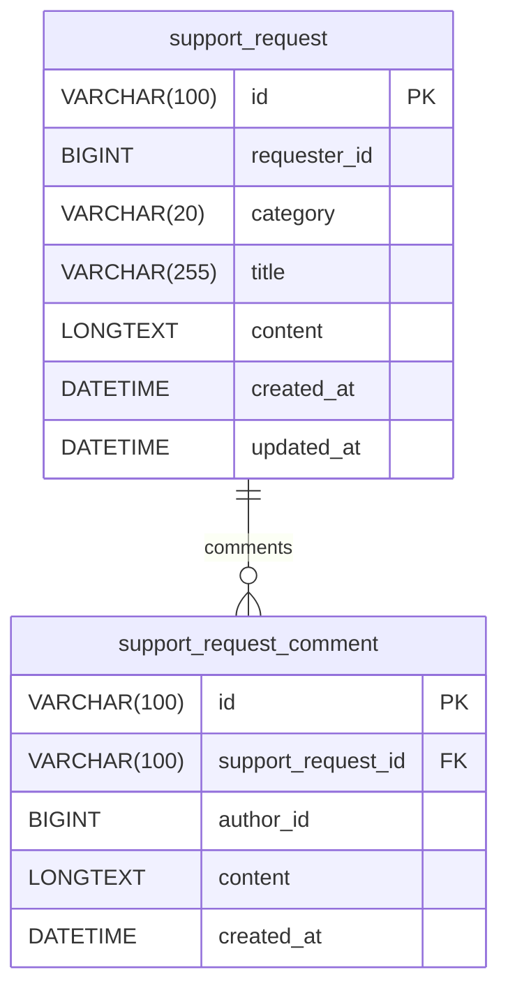

# 지원 신청 Backend

## 작업 개요

회원이 지원 신청을 등록하고 모든 회원이 신청과 댓글을 확인할 수 있는 지원 신청 리소스를 제공한다. 지원 신청, 댓글, 접근 권한 및 알림을 Backend가 소유한다. 완료 시 `sight-frontend`가 지원 신청의 등록, 목록, 상세 조회, 수정, 삭제 및 신청자·운영진 댓글 작성에 사용할 HTTP API와 Discord·사이트 내 알림 동작을 제공한다.

## 비즈니스 동작

- `USER` 또는 `MANAGER` 역할의 회원은 제목, 내용 및 카테고리로 지원 신청을 등록할 수 있다. 카테고리는 `SERVER_SPACE`, `SUBDOMAIN`, `HARDWARE`, `BOOK`, `OTHER` 중 하나다.
- 지원 신청의 신청자는 첫 댓글이 아직 없을 때만 제목, 내용 및 카테고리를 변경할 수 있다. 운영진은 첫 댓글의 존재와 관계없이 모든 지원 신청을 삭제할 수 있다.
- `USER` 또는 `MANAGER` 역할의 모든 회원은 모든 지원 신청과 댓글을 열람할 수 있다.
- 지원 신청의 신청자는 자신의 지원 신청에, 운영진은 모든 지원 신청에 댓글을 작성할 수 있다. 댓글의 생성은 승인, 반려 또는 완료 상태를 만들지 않는다.
- 지원 신청이 생성되면 모든 운영진에게 사이트 내 알림을 만들고 Discord 시스템 알림 Webhook에 등록 사실을 전송한다.
- 댓글이 생성되면 모든 운영진과 신청자에게 사이트 내 알림을 만든다. 신청자가 운영진인 경우에도 해당 신청자에게는 알림을 한 건만 만든다. 운영진이 작성한 댓글이면 신청자가 Discord 연동 상태일 때만 Discord DM을 전송한다.
- 사이트 내 알림 또는 Discord 전송이 실패해도 생성된 지원 신청이나 댓글은 취소하지 않는다.
- 지원 신청 또는 댓글 생성 요청은 멱등하게 처리하지 않는다. 같은 내용의 요청이 반복되면 요청마다 별도의 지원 신청 또는 댓글을 생성하고, 각 생성에 따른 사이트 내 알림과 Discord 전송을 각각 수행한다.

## HTTP API 계약

### 공통 representation

모든 지원 신청 식별자와 댓글 식별자는 ULID 문자열이고, 시각 field는 ISO 8601 UTC 문자열이다. `requester`와 `author` 회원 정보는 `userId`와 `name`만 제공한다.

`SupportRequest`는 다음 JSON 구조다.

```json
{
  "id": "01JQ5J4ZAVY7YKA0GHRD33RHZG",
  "category": "SERVER_SPACE",
  "title": "프로젝트 서버 공간 지원 요청",
  "content": "배포 환경에 사용할 서버 공간이 필요합니다.",
  "requester": {
    "userId": 123,
    "name": "홍길동"
  },
  "hasComments": false,
  "createdAt": "2026-08-21T09:00:00Z",
  "updatedAt": "2026-08-21T09:00:00Z"
}
```

`SupportRequestDetail`은 `SupportRequest`의 field와 생성 시각 오름차순 `comments` 배열을 포함하는 다음 JSON 구조다.

```json
{
  "id": "01JQ5J4ZAVY7YKA0GHRD33RHZG",
  "category": "SERVER_SPACE",
  "title": "프로젝트 서버 공간 지원 요청",
  "content": "배포 환경에 사용할 서버 공간이 필요합니다.",
  "requester": {
    "userId": 123,
    "name": "홍길동"
  },
  "hasComments": true,
  "createdAt": "2026-08-21T09:00:00Z",
  "updatedAt": "2026-08-21T09:00:00Z",
  "comments": [
    {
      "id": "01JQ5J6CZW7YKA0GHRD33RHZH",
      "content": "필요한 용량과 사용 기간을 알려주세요.",
      "author": {
        "userId": 456,
        "name": "김운영"
      },
      "createdAt": "2026-08-21T09:10:00Z"
    }
  ]
}
```

`SupportRequestComment`는 `SupportRequestDetail.comments`의 각 항목과 같은 다음 JSON 구조다.

```json
{
  "id": "01JQ5J6CZW7YKA0GHRD33RHZH",
  "content": "필요한 용량과 사용 기간을 알려주세요.",
  "author": {
    "userId": 456,
    "name": "김운영"
  },
  "createdAt": "2026-08-21T09:10:00Z"
}
```

### POST /support-requests

`USER` 또는 `MANAGER` 인증 회원이 지원 신청을 생성한다.
- Request body
  - `category`: 필수 enum. `SERVER_SPACE`, `SUBDOMAIN`, `HARDWARE`, `BOOK`, `OTHER` 중 하나
  - `title`: 필수 string. 공백만 허용하지 않고 최대 255자
  - `content`: 필수 string. 공백만 허용하지 않음

성공하면 `201 Created`와 `SupportRequest` body를 반환한다. 유효하지 않은 field에는 `400 Bad Request`를 반환한다. 같은 내용의 요청이 반복되면 요청마다 새 지원 신청을 생성한다.

### GET /support-requests

`USER` 또는 `MANAGER` 인증 회원이 모든 지원 신청을 조회한다.

- Query string
  - `offset`: 선택 number. 기본값 `0`, `0` 이상
  - `limit`: 선택 number. 기본값 `20`, `1` 이상 `100` 이하
  - `category`: 선택 enum. `SERVER_SPACE`, `SUBDOMAIN`, `HARDWARE`, `BOOK`, `OTHER` 중 하나
- Response body
  - `count`: 전체 조회 결과 수를 나타내는 number
  - `supportRequests`: `createdAt` 내림차순으로 정렬된 `SupportRequest[]`

성공하면 `200 OK`를 반환한다. 유효하지 않은 query string에는 `400 Bad Request`를 반환한다.

### GET /support-requests/{supportRequestId}

`USER` 또는 `MANAGER` 인증 회원이 하나의 지원 신청과 댓글을 조회한다.

- Path parameter
  - `supportRequestId`: 조회할 지원 신청의 ULID 문자열

성공하면 `200 OK`와 `SupportRequestDetail` body를 반환한다. 지원 신청이 존재하지 않으면 `404 Not Found`를 반환한다.

### PUT /support-requests/{supportRequestId}

신청자만 첫 댓글이 없는 자신의 지원 신청을 변경할 수 있다.

- Path parameter
  - `supportRequestId`: 변경할 지원 신청의 ULID 문자열
- Request body
  - `category`: 필수 enum. `SERVER_SPACE`, `SUBDOMAIN`, `HARDWARE`, `BOOK`, `OTHER` 중 하나
  - `title`: 필수 string. 공백만 허용하지 않고 최대 255자
  - `content`: 필수 string. 공백만 허용하지 않음

성공하면 `200 OK`와 갱신된 `SupportRequest` body를 반환한다. 지원 신청이 존재하지 않거나 요청자가 신청자가 아니면 `404 Not Found`, 첫 댓글이 생성된 경우에는 `409 Conflict`, 유효하지 않은 field에는 `400 Bad Request`를 반환한다.

### DELETE /support-requests/{supportRequestId}

운영진만 첫 댓글의 존재와 관계없이 모든 지원 신청을 삭제할 수 있다.

- Path parameter
  - `supportRequestId`: 삭제할 지원 신청의 ULID 문자열

성공하면 `204 No Content`를 반환한다. 지원 신청이 존재하지 않으면 `404 Not Found`, 운영진이 아닌 회원의 요청에는 `403 Forbidden`을 반환한다.

### POST /support-requests/{supportRequestId}/comments

신청자는 자신의 지원 신청에만, 운영진은 모든 지원 신청에 댓글을 생성할 수 있다.

- Path parameter
  - `supportRequestId`: 댓글을 생성할 지원 신청의 ULID 문자열
- Request body
  - `content`: 필수 string. 공백만 허용하지 않음

성공하면 `201 Created`와 `SupportRequestComment` body를 반환한다. 지원 신청이 존재하지 않으면 `404 Not Found`, 운영진이 아닌 회원이 다른 회원의 지원 신청에 댓글을 작성하려고 하면 `403 Forbidden`, 유효하지 않은 body에는 `400 Bad Request`를 반환한다. 같은 내용의 요청이 반복되면 요청마다 새 댓글을 생성한다. 댓글 수정과 삭제 API는 제공하지 않는다.

### 유지할 계약

기존 `GET /notifications`, `POST /notifications/read` 사이트 내 알림 API의 representation과 인증 계약은 변경하지 않는다. 기존 Discord 연동 정보의 조회와 연결 해제 계약도 변경하지 않는다.

## 데이터베이스 계약



- 모든 diagram field는 `NOT NULL`이다.
- `category`는 `SERVER_SPACE`, `SUBDOMAIN`, `HARDWARE`, `BOOK`, `OTHER`만 허용한다.
- `support_request_comment.support_request_id`는 `support_request.id`를 참조하고 cascade delete를 사용한다. 운영진이 지원 신청을 삭제하면 해당 지원 신청의 모든 댓글도 함께 영구 삭제한다.
- 새 table 생성 후 지원 신청 API를 배포한다. rollback은 새 API 사용 중지 후 새 table을 제거하는 방식으로만 허용한다.

## 외부 시스템 계약

- Discord Incoming Webhook을 사용해 `discord.webhook.system-alert-url` 설정값(`SYSTEM_ALERT_DISCORD_WEBHOOK`)에 지원 신청 등록 사실을 전송한다. payload에는 지원 신청 ID, 카테고리, 제목과 신청자 표시 이름을 포함하고 본문 전체는 포함하지 않는다.
- 운영진 댓글의 Discord DM은 `discord_integration`에 저장된 신청자의 Discord user ID로 전송한다. payload에는 지원 신청 ID, 제목 및 댓글 작성자 표시 이름을 포함하고 댓글 본문 전체는 포함하지 않는다.
- 운영진 댓글 DM에는 기존 `DISCORD_BOT_TOKEN`을 사용한다. 시스템 알림 Webhook URL이 비어 있으면 지원 신청 등록 전송을 건너뛰고, Webhook 또는 DM 전송이 실패하면 error log를 남긴다. 어느 경우에도 HTTP 응답과 DB transaction을 실패시키지 않는다.
- Discord Webhook과 Bot API 호출은 timeout을 두고 자동 재시도하지 않는다. 반복된 생성 요청마다 별도의 Discord 전송을 시도한다.

## 보안 및 개인정보

- 모든 API는 인증이 필요하다. 목록과 상세 조회는 모든 인증 회원에게 허용하고, 댓글 작성은 신청자 또는 운영진으로, 수정은 첫 댓글이 없는 신청자로, 삭제는 첫 댓글의 존재와 관계없이 운영진으로 서버에서 강제한다.
- 지원 신청 제목과 내용, 댓글은 동아리 운영 관련 정보이므로 인증되지 않은 사람이나 Discord 시스템 알림 Webhook 이외의 외부 대상에게 반환하거나 전달하지 않는다.
- Discord 운영 알림과 DM에는 요청·댓글 본문을 넣지 않는다. Discord user ID, 요청 내용 및 댓글 본문을 application log, metric, tracing attribute에 기록하지 않는다.
- Discord DM은 연동된 신청자에게만 보내며, 연동되지 않은 회원을 위해 Discord ID를 추정하거나 새 연동을 만들지 않는다.

## 비가역적 부작용 및 운영 영향

- 지원 신청 삭제는 운영진만 수행할 수 있는 영구 삭제다. 댓글이 있으면 함께 영구 삭제되며, 삭제 뒤에는 목록과 상세 조회에서 반환하지 않고 복구 기능도 제공하지 않는다.
- 지원 신청·댓글 생성은 사이트 내 알림 생성과 Discord 외부 메시지 전송을 유발한다. 반복된 생성 요청도 각각 새 리소스와 외부 메시지를 만들 수 있다.

## 호환성 및 배포

- 새 API와 새 table은 기존 API를 변경하지 않는다. `sight-frontend`의 지원 신청 화면은 Backend 배포와 `SYSTEM_ALERT_DISCORD_WEBHOOK` 설정 후 공개한다.
- 시스템 알림 Webhook URL 또는 Bot 권한이 준비되지 않은 환경에서도 API는 동작하지만 해당 Discord 알림만 생략된다.

## 검증

- 인증 회원과 운영진이 각 카테고리로 지원 신청을 생성하면 `201` 응답의 `requester`가 등록한 회원을 가리키고, 운영진 사이트 내 알림과 Discord 시스템 알림 Webhook 전송이 발생하는지 controller·service integration test로 확인한다.
- 일반 회원과 운영진의 목록에 모든 신청이 생성 시각 내림차순으로 반환되고, 일반 회원도 다른 회원의 상세와 댓글을 조회할 수 있는지 확인한다.
- 첫 댓글 전 신청자는 수정할 수 있고, 운영진은 댓글 유무와 관계없이 다른 회원의 신청과 댓글을 함께 삭제할 수 있으며, 첫 댓글 생성과 동시에 신청자 수정 요청이 `409`가 되는지 동시 요청을 포함한 service test로 확인한다.
- 일반 회원이 자신의 지원 신청에 댓글을 생성하면 신청자 사이트 내 알림이 생성되고, 다른 회원의 지원 신청에 대한 댓글 요청은 `403`으로 거절되며, 운영진 댓글 생성 시에도 신청자 사이트 내 알림·연동된 경우의 DM 전송을 확인한다.
- 미연동 신청자, Discord DM 차단, 시스템 알림 Webhook URL 누락, Discord Webhook 또는 Bot API timeout·실패에서 지원 신청·댓글이 성공적으로 남고 HTTP 성공 응답이 유지되는지 확인한다.
- 빈 값, 허용되지 않은 카테고리, 잘못된 pagination에 `400`이 반환되고, 같은 생성 요청의 반복마다 별도 지원 신청 또는 댓글과 해당 알림이 생성되는지 확인한다.
- 새 table migration을 빈 DB에 적용해 필요한 table과 constraint가 생성되는지 확인한다.

## 비목표

- 지원 신청의 승인, 반려, 완료 상태 및 그에 따른 예산·자산·도서·서버 자원 할당은 제공하지 않는다.
- 댓글의 수정·삭제와 Discord 실패 메시지 재전송은 제공하지 않는다.
