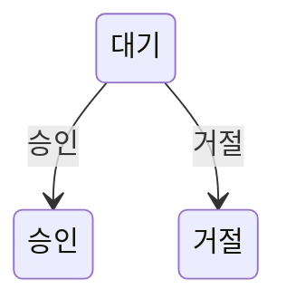

# Policy lint

## Binary build

저장소 root에서 다음 명령을 실행한다.

```text
docker buildx build --file tools/policy-lint/Dockerfile --output type=local,dest=tools/policy-lint/bin .
```

생성된 binary는 `tools/policy-lint/bin/`에 저장되며 Git에 포함하지 않는다. Docker build는 unit test를 실행한 뒤 macOS, Windows 및 Linux용 binary를 생성한다.

## 실행

macOS Apple Silicon:

```text
tools/policy-lint/bin/policy-lint-darwin-arm64
```

macOS Intel:

```text
tools/policy-lint/bin/policy-lint-darwin-amd64
```

Windows x64:

```text
tools\policy-lint\bin\policy-lint-windows-amd64.exe
```

Windows ARM64:

```text
tools\policy-lint\bin\policy-lint-windows-arm64.exe
```

Linux x64:

```text
tools/policy-lint/bin/policy-lint-linux-amd64
```

Linux ARM64:

```text
tools/policy-lint/bin/policy-lint-linux-arm64
```

저장소 하위 경로에서 실행하면 `policy/`와 `tools/policy-lint/`가 있는 저장소 root를 상위 경로에서 찾는다. 다른 위치의 저장소를 검사하려면 `--root`에 경로를 지정한다.

```text
tools/policy-lint/bin/policy-lint-darwin-arm64 --root /path/to/sight-workspace
```

lint source가 binary build 이후 변경되면 실행을 중단하고 binary를 다시 build하도록 안내한다.

## CI

`.github/workflows/policy-lint.yml`은 `main` branch를 대상으로 하는 push와 pull request에서 실행된다. lint source와 Dockerfile을 기준으로 binary cache를 사용하고, cache가 없으면 Docker로 binary를 build한 뒤 Linux x64 binary로 정책 구조와 `POLICY.md` 형식을 검사한다.

## 검증 범위

`policy/` 바로 아래에는 다음 항목만 존재할 수 있다.

- 일반 파일인 `STANDARD.md`
- 일반 파일인 `GLOSSARY.md`
- 도메인 디렉터리

`STANDARD.md`와 `GLOSSARY.md`는 반드시 존재해야 한다. 각 도메인 디렉터리는 다음 구조만 가질 수 있다.

```text
<도메인>/
├── POLICY.md
└── HISTORY.md
```

- `POLICY.md`는 반드시 존재하는 일반 파일이다.
- `HISTORY.md`는 선택적으로 존재할 수 있는 일반 파일이다.
- 그 밖의 파일, 하위 디렉터리, 심볼릭 링크 및 다른 종류의 항목은 허용하지 않는다.
- 도메인 디렉터리명의 문자 구성은 검사하지 않는다.

### `POLICY.md` 형식

`POLICY.md`의 첫 번째 내용은 비어 있지 않은 H1 제목이어야 한다. H1은 문서에 정확히 하나만 존재하며, 제목을 도메인 디렉터리명과 일치시킬 필요는 없다. 아직 정의할 정책이 없는 도메인은 H1만 작성할 수 있다.

H2 섹션으로는 `적용 범위`와 `정책`만 사용할 수 있다. 각 섹션은 최대 한 번만 사용할 수 있고, 두 섹션을 모두 사용하면 `적용 범위`, `정책` 순서로 작성한다.

`적용 범위`는 선택 섹션이다. 이 섹션을 작성하면 비어 있지 않은 일반 문단을 하나 이상 작성해야 한다. 목록, 표, code block 및 하위 제목은 사용할 수 없다. `적용 범위`만 작성하고 아직 `정책`을 작성하지 않을 수도 있다.

`정책` 섹션을 작성하면 하나 이상의 H3 정책 항목이 필요하다. 각 H3 제목은 비어 있을 수 없고 같은 문서 안에서 중복될 수 없다. H3보다 낮은 단계의 제목은 사용할 수 없다.

각 H3 정책 항목에는 다음 block을 순서와 개수 제한 없이 사용할 수 있다.

- unordered list
- GitHub Flavored Markdown 표
- Mermaid diagram을 정의하는 `mermaid` fenced code block

각 정책 항목에는 하나 이상의 unordered list가 필요하다. 모든 unordered list marker는 하이픈(`-`)을 사용한다. 중첩 list를 허용하고 깊이는 제한하지 않지만, 모든 list item은 자체 문장 내용을 가져야 한다. Ordered list, list 밖의 일반 문단 및 list item 안의 표와 code block은 사용할 수 없다.

표에는 비어 있지 않은 header cell과 하나 이상의 data row가 필요하며, 모든 cell은 비어 있을 수 없다. 적용할 값이 없으면 빈 cell 대신 `해당 없음`처럼 의미를 명시한다.

Mermaid fenced code block은 언어를 `mermaid`로 지정하고 비어 있지 않은 내용을 작성한다. Mermaid 이외의 code block은 사용할 수 없다. Mermaid 문법 자체의 유효성은 검사하지 않는다.

다음 문서는 허용되는 형식의 예시다.

````markdown
# 참가 신청 정책

## 적용 범위

이 문서는 회원의 참가 신청 생성, 승인, 거절 및 취소에 관한 판단을 정의한다.

## 정책

### 참가 신청 상태 전이

| 현재 상태 | 처리 | 변경 상태 |
| --- | --- | --- |
| 대기 | 승인 | 승인 |
| 대기 | 거절 | 거절 |

- 표에 정의되지 않은 상태 전이는 허용하지 않는다.



- 상태 전이의 판단은 요청 시점의 현재 상태를 기준으로 한다.
````

### Markdown link

로컬 Markdown link는 현재 `POLICY.md`를 기준으로 한 상대경로를 사용해야 한다. link 대상은 repository 안에 존재하는 일반 파일이어야 한다. 다른 정책을 참조할 때에는 대상 `POLICY.md` 전체를 가리키며 heading fragment를 사용할 수 없다. 외부 URL은 대상 존재 여부를 검사하지 않는다.

## 종료 코드

- `0`: lint 성공
- `1`: 허용되지 않은 정책 구조 또는 `POLICY.md` 형식 발견
- `2`: 저장소 탐색, 파일 읽기 또는 binary source hash 검증 실패
